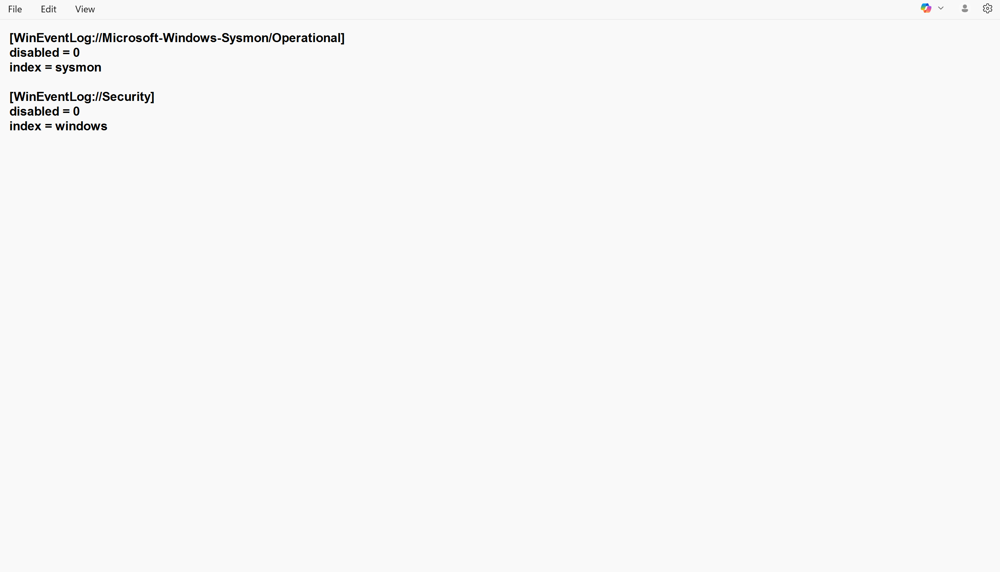
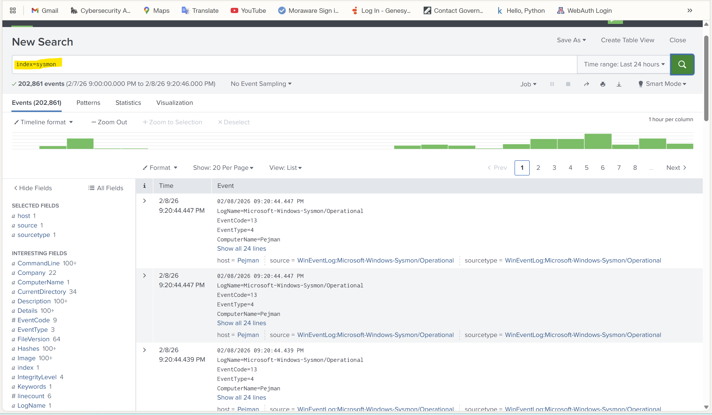
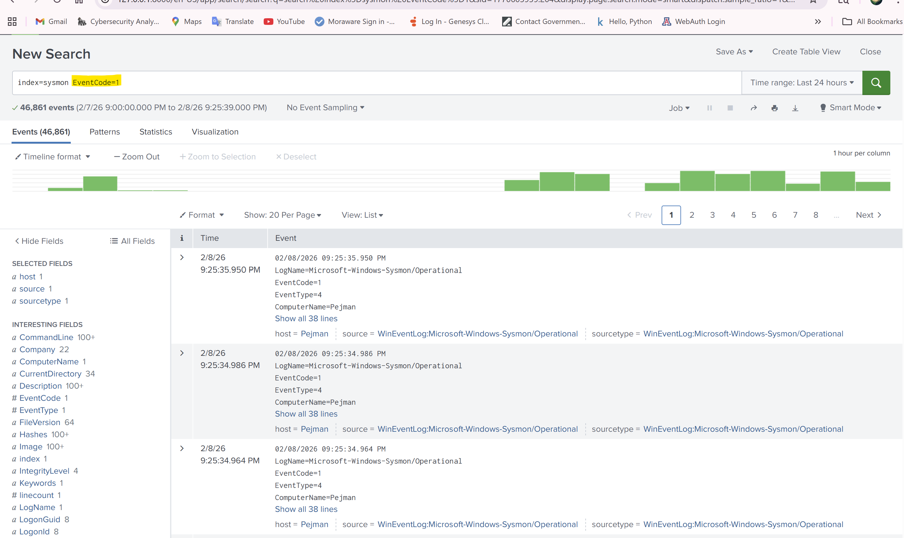

# SOC Home Lab – Splunk + Sysmon

This project demonstrates a basic SOC monitoring environment using **Sysmon** and **Splunk** for Windows log collection, visibility, and detection.

The lab simulates a real-world setup where endpoint activity is forwarded to a SIEM for investigation and threat hunting.

---

## Lab Architecture

**Components**

* Windows 10 (endpoint)
* Sysmon (endpoint telemetry)
* Splunk Universal Forwarder
* Splunk Enterprise (local SIEM)

**Log Flow**

Sysmon → Windows Event Logs → Universal Forwarder → Splunk → Search & Detection

---

## Data Sources Collected

### Sysmon Operational Logs

* Process creation
* Network connections
* File activity
* Image loads

Source:

```
WinEventLog://Microsoft-Windows-Sysmon/Operational
```

### Windows Security Logs

Source:

```
WinEventLog://Security
```

---

## Splunk Inputs Configuration

Index used:

* `sysmon`
* `windows`

Forwarder configured through `inputs.conf`.

---

## Detection Example

### Process Creation Monitoring

Query:

```
index=sysmon EventCode=1
```

This shows all process creation events, including:

* Command line
* Parent process
* User context
* Process path

Useful for detecting:

* Suspicious PowerShell
* LOLBins
* Malware execution
* Persistence activity

---

## Screenshots

### Sysmon Service Installed and Running


### Universal Forwarder Running


### Splunk Inputs Configuration



### Sysmon Events in Splunk



### Process Creation Detection (EventCode=1)



---

## Skills Demonstrated

* SIEM deployment and configuration
* Endpoint log collection
* Sysmon configuration
* Splunk data ingestion
* Event analysis and investigation
* Basic detection engineering

---

## Future Improvements

* PowerShell suspicious activity detection
* MITRE ATT&CK mapping
* Custom correlation searches
* Dashboards for SOC monitoring
* Threat hunting queries

---

## Author

Pejman Nejad  
Aspiring SOC Analyst focused on detection engineering and threat hunting  
GitHub: https://github.com/pejnejad
